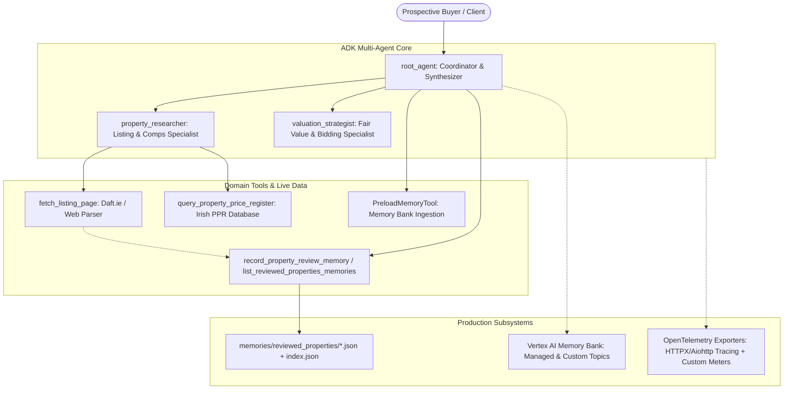

# Real Estate Advisory Agent — Project Handover & Progress Report

**Document Date:** October 1, 2026  
**Repository:** [https://github.com/gmotzespina/real-state-agent](https://github.com/gmotzespina/real-state-agent)  
**Branch:** `main`  
**GCP Project:** `l200-agent` (Project ID: `507598745861`)  
**Vertex AI Region:** `us-east1`  
**Agent Engine Resource ID:** `projects/507598745861/locations/us-east1/reasoningEngines/2363050599206879232`  

---

## 1. Executive Summary & Objective

The **Real Estate Advisory Agent** is a multi-agent AI system built on the Google Agent Development Kit (ADK) that advises prospective homebuyers in the Irish property market. It automates:
1. **Property Listing Extraction:** Extracting key property specifications (asking price, address, Eircode, bedrooms, property type) from Irish real estate listing URLs (Daft.ie, MyHome.ie).
2. **Irish Property Price Register (PPR) Comps Analysis:** Searching the official Irish Property Price Register by address, area, and county to retrieve historical completed transactions and compute baseline benchmarks.
3. **Valuation Modeling & Tactical Bidding Strategy:** Formulating three-tier fair valuation ranges (Low, Benchmark, High) anchored in PPR comps, along with tactical opening bids, recommended counter-offer increments, and strict walk-away ceilings aligned with buyer budget constraints.
4. **Production Observability & Granular Network Tracing:** Enterprise-grade OpenTelemetry auto-instrumentation, custom metrics histograms, and trace spans exported to Google Cloud Trace and Cloud Monitoring.
5. **Cross-Session Memory & Reviewed Property JSON Storage:** Vertex AI Memory Bank configuration for long-term buyer preferences (target areas, budgets, property types) coupled with structured filesystem JSON persistence for every reviewed home.

---

## 2. System Architecture



### Multi-Agent Components:
- **`root_agent` (`app/agent.py`)**: Top-level coordinator that enforces a mandatory 3-stage execution pipeline (Research $\rightarrow$ Valuation & Strategy $\rightarrow$ Synthesis). Injects recalled memory preferences and triggers cross-session memory synthesis.
- **`property_researcher` (`app/agent.py`)**: Sub-agent dedicated to extracting listing details and querying historical comps from the Property Price Register.
- **`valuation_strategist` (`app/agent.py`)**: Specialized LLM agent analyzing comps, calculating square-meter benchmarks, and creating disciplined bidding rules.

### Serving Surfaces:
- **FastAPI / ADK Web (`app/fast_api_app.py`)**: Serves the agent over standard HTTP/REST with Server-Sent Events (SSE) streaming and interactive playground UI.
- **A2A Protocol (`/a2a/app`)**: Agent-to-Agent communication endpoint supporting automated multi-agent delegations.
- **Vertex AI Reasoning Engine Adapter (`reasoning_engine_adapter.py`)**: Bridges Cloud AI Platform Agent Runtime calls into ADK runners.

---

## 3. Implemented Capabilities & Deliverables

### A. Listing Extraction & PPR Analysis (`app/tools.py`)
- **`fetch_listing_page(url)`**: Extracts property titles, descriptions, asking prices, bedroom counts, Eircodes, and structured JSON-LD schemas. Automatically persists extracted metadata to property memory.
- **`query_property_price_register(address_query, county, limit)`**: Queries the official Irish Property Price Register API (`propertypriceregister.ie`) with clean query sanitization, date normalization, and price formatting.
- **Session State Integration**: Injects discovered listings into `session:current_listing` and maintains history in `session:analyzed_properties`.

### B. Observability & Tracing (`app/app_utils/telemetry.py`)
- Fully compliant with [Google Cloud AI Agent ADK Observability Standards](https://docs.cloud.google.com/stackdriver/docs/instrumentation/ai-agent-adk).
- **Network Auto-Instrumentation**:
  - `HTTPXClientInstrumentor().instrument()`: Captures all outbound HTTP requests made by web scrapers and APIs.
  - `AioHttpClientInstrumentor().instrument()`: Instruments all asynchronous Google GenAI and Vertex AI API network calls.
- **OpenTelemetry Metric Instruments**:
  - `real_estate.ppr.query_duration_ms`: Latency histogram of PPR search queries.
  - `real_estate.ppr.comps_retrieved`: Counter tracking volume of comparable sales data extracted.
  - `real_estate.listing.fetches_total`: Counter tracking listing page fetch outcomes (`status: success`, `error_status_code`, `error_exception`).
  - `real_estate.bidding.strategies_total`: Counter tracking generated bidding strategies.
- **Trace Spans & Domain Attributes**: Injects attributes into current OpenTelemetry spans (`real_estate.ppr.address_query`, `real_estate.listing.asking_price`, `real_estate.listing.eircode`).
- **Data Governance**: Configured `OTEL_INSTRUMENTATION_GENAI_CAPTURE_MESSAGE_CONTENT=NO_CONTENT` and `ADK_CAPTURE_MESSAGE_CONTENT_IN_SPANS=false` in deployment runtime for enterprise privacy.
- Score in `evaluation_criteria.md`: **20/20 Points** for Observability.

### C. Vertex AI Memory Bank Integration (`app/app_utils/memory_config.py`)
- **Managed Topics Configured**:
  - `ManagedTopicEnum.USER_PERSONAL_INFO`: Captures buyer status, family parameters, first-time buyer eligibility.
  - `ManagedTopicEnum.USER_PREFERENCES`: Captures locations, budget limits, preferred house types, garden/parking needs.
  - `ManagedTopicEnum.EXPLICIT_INSTRUCTIONS`: Captures instructions explicitly stated by the user.
  - `ManagedTopicEnum.KEY_CONVERSATION_DETAILS`: Captures key negotiation decisions and reviewed properties.
- **Custom Topic Configured**:
  - `PROPERTY_PREFERENCES_AND_REVIEWED_HOMES`: Structured user search criteria, searched neighborhoods, floor area requirements, and price ceilings.
- **Lifecycle Integration**:
  - `PreloadMemoryTool()` added to `root_agent` tools to auto-inject recalled memories into system instructions at the start of each turn.
  - `generate_memories_callback` attached as `after_agent_callback` to flush turn events via `await callback_context.add_session_to_memory()`.

### D. Reviewed Property JSON Storage (`app/property_memory.py`)
- Whenever a listing is fetched or reviewed, structured metadata is written to disk:
  - File path pattern: `memories/reviewed_properties/<property_id>.json`
  - Global registry: `memories/reviewed_properties/index.json`
- **Metadata Fields Stored**:
  - `property_id`, `address`, `eircode`, `area`, `county`, `asking_price_eur`, `size_sqm`, `size_sqft`, `bedrooms`, `bathrooms`, `property_type`, `ber_rating`, `url`, `review_timestamp`, `valuation_estimate`, `bidding_strategy`, `user_notes`.
- **Exposed Tools**:
  - `record_property_review_memory(...)`: Explicitly records or updates a reviewed property.
  - `list_reviewed_properties_memories(...)`: Lists all previously reviewed properties with summarized metadata across sessions.

---

## 4. Test Suite & Code Quality Status

### Unit & Integration Tests:
- **Total Tests Passing: 21 / 21**
  - `tests/unit/test_dummy.py`: Basic framework validation (1 test).
  - `tests/unit/test_property_memory.py`: Memory Bank schema, JSON persistence, index registration, callback delegation (5 tests).
  - `tests/unit/test_real_estate.py`: Scraper parsing, regex extraction, PPR queries, and coordinator delegation (7 tests).
  - `tests/unit/test_telemetry.py`: HTTP client instrumentation, metric counters, latency histograms, span attributes (3 tests).
  - `tests/integration/test_agent.py`: Agent execution and SSE streaming (1 test).
  - `tests/integration/test_server_e2e.py`: FastAPI routes, health checks, feedback endpoint, A2A endpoint (4 tests).

### Linter & Type Checking (`agents-cli lint`):
- `ruff check .`: **0 errors** (all checks passed).
- `ruff format . --check`: **27 files properly formatted**.
- `codespell`: **No spelling errors**.
- `ty check .`: **0 type diagnostics** (all checks passed).

---

## 5. Deployment & Cloud Infrastructure

| Parameter | Value |
| :--- | :--- |
| **GCP Project** | `l200-agent` (`507598745861`) |
| **GCP Region** | `us-east1` |
| **Runtime Target** | Vertex AI Agent Runtime (Reasoning Engine) |
| **Resource ID** | `projects/507598745861/locations/us-east1/reasoningEngines/2363050599206879232` |
| **Model** | `gemini-3.6-flash` |
| **Telemetry Service** | `real-estate-agent` |
| **Cloud Tracing** | Active (Google Cloud Trace) |
| **Cloud Logging** | Active (Structured Cloud Logging) |
| **Remote Git Repo** | `https://github.com/gmotzespina/real-state-agent` (branch `main`) |

---

## 6. Project Directory Map

```
real-estate-agent/
├── app/
│   ├── agent.py                 # Multi-agent definitions, instructions, memory callbacks
│   ├── fast_api_app.py          # FastAPI application, lifespan, shared services wiring
│   ├── property_memory.py       # JSON memory storage and index for reviewed properties
│   ├── tools.py                 # Listing extraction, PPR API search, and memory tools
│   └── app_utils/
│       ├── memory_config.py     # Vertex AI Memory Bank managed and custom topic configuration
│       ├── services.py          # Process-wide shared session, artifact, and memory services
│       ├── telemetry.py         # OpenTelemetry HTTP instrumentation and domain metric meters
│       ├── a2a.py               # A2A protocol routes
│       └── reasoning_engine_adapter.py # Cloud Reasoning Engine adapter
├── memories/
│   └── reviewed_properties/     # Persisted property JSON files and index.json
├── tests/
│   ├── unit/                    # 16 unit tests for tools, memory, agent, telemetry
│   └── integration/             # 5 E2E and streaming integration tests
├── evaluation_criteria.md       # Scorecard documenting criteria alignment (including 20/20 telemetry)
├── pyproject.toml               # Project dependencies and tool configurations
└── PROJECT_HANDOVER_AND_PROGRESS.md # This handover document
```

---

## 7. How to Resume Work & Next Steps

When resuming work on this repository:

1. **Environment Setup**:
   ```bash
   cd /home/admin_/real-estate-agent
   uv sync
   source .venv/bin/activate
   ```

2. **Run Quality Checks & Tests**:
   ```bash
   agents-cli lint
   GOOGLE_GENAI_USE_VERTEXAI=True GOOGLE_CLOUD_PROJECT=l200-agent GOOGLE_CLOUD_LOCATION=global uv run pytest tests/unit tests/integration
   ```

3. **Check Cloud Deployment Status**:
   ```bash
   agents-cli deploy --status --project l200-agent --region us-east1
   ```

4. **Recommended Roadmap Items**:
   - **Agent Evaluation**: Run `agents-cli eval` using custom real estate query datasets to benchmark multi-turn accuracy and valuation precision against ground-truth PPR comps.
   - **Scraper Resilience**: Implement fallback headless scraping (e.g., Playwright / Crawl4AI) or Daft.ie API proxies for listings protected by strict Cloudflare bot verification.
   - **Publishing & Fleet Registration**: Publish the agent to Gemini Enterprise using `agents-cli publish gemini-enterprise`.
   - **BigQuery Analytics**: Export long-term OpenTelemetry agent metrics from Cloud Monitoring into BigQuery for price-trend analytics.
